# ResetRx Platform Architecture

This document provides an overview of the ResetRx health platform architecture, showing how all components work together to deliver personalized health coaching, lab results, and wellness plans.

## System Architecture Diagram

```mermaid
%%{init: {'theme':'base'}}%%
graph TB
    subgraph "Daily Customer Interaction"
        Mobile[Mobile App]
        Dashboard[Dashboard & Health Score]
        Eva[Eva AI Coach]
        Logging[Activity & Food Logging]
        Progress[Progress Tracking]
        NutritionUI[Nutrition Plan View]
        ExerciseUI[Exercise Plan View]
        MindsetUI[Mindset Plan View]
        SleepUI[Sleep Plan View]
        
        Mobile --> Dashboard
        Mobile --> Eva
        Mobile --> Logging
        Mobile --> Progress
        Mobile --> NutritionUI
        Mobile --> ExerciseUI
        Mobile --> MindsetUI
        Mobile --> SleepUI
    end
    
    subgraph "Marketing & Commerce"
        Shopify[Shopify E-commerce]
        Products[Product Catalog]
        Checkout[Checkout & Payment]
        Klaviyo[Klaviyo Marketing]
        EmailFlows[Email Flows & Campaigns]
        
        Shopify --> Products
        Shopify --> Checkout
        Klaviyo --> EmailFlows
    end
    
    subgraph "Core Services - Suggestic Platform"
        GraphQLAPI[GraphQL API]
        UserProfiles[User Profiles & Auth]
        NutritionEngine[Nutrition Plan Engine]
        BiomarkerDB[Biomarker Storage]
        CustomAttributes[Custom Attributes]
        HealthData[Health Data & Metrics]
        Database[(Database)]
        
        GraphQLAPI --> UserProfiles
        GraphQLAPI --> NutritionEngine
        GraphQLAPI --> BiomarkerDB
        GraphQLAPI --> CustomAttributes
        GraphQLAPI --> HealthData
        UserProfiles --> Database
        BiomarkerDB --> Database
        CustomAttributes --> Database
        HealthData --> Database
    end
    
    subgraph "AI Services"
        OpenAI[OpenAI API]
        EvaLogic[Eva Coaching Logic]
        
        OpenAI --> EvaLogic
    end
    
    subgraph "Lab Results Pipeline - Netlify Functions"
        AppointmentSvc[Appointment Management]
        LabResultsSync[Lab Results Sync<br/>Scheduled/On-Demand]
        UserMatching[User Matching by Order Key]
        BiomarkerProcessor[Biomarker Data Processor<br/>Unit Mapping & Alerts]
        NotificationSvc[Notification Service]
        
        AppointmentSvc --> UserMatching
        LabResultsSync --> UserMatching
        LabResultsSync --> BiomarkerProcessor
        BiomarkerProcessor --> NotificationSvc
    end
    
    subgraph "Health Scoring System - Netlify Functions"
        ScoreCalculator[Score Calculator]
        WeightMetrics[Weight Tracking]
        SleepMetrics[Sleep Quality]
        MovementMetrics[Movement/Exercise]
        MindfulnessMetrics[Mindfulness]
        NutritionMetrics[Nutrition Adherence]
        
        ScoreCalculator --> WeightMetrics
        ScoreCalculator --> SleepMetrics
        ScoreCalculator --> MovementMetrics
        ScoreCalculator --> MindfulnessMetrics
        ScoreCalculator --> NutritionMetrics
    end
    
    subgraph "Plan Generation - Netlify Functions"
        ExercisePlanGen[Exercise Plan Generator]
        MindsetPlanGen[Mindset Plan Generator]
        SleepPlanGen[Sleep Plan Generator]
    end
    
    subgraph "External APIs"
        KHSS[KHSS/Quest Diagnostics]
        LabOrders[Lab Order Submission]
        LabResults[Test Results Retrieval]
        
        KHSS --> LabOrders
        KHSS --> LabResults
    end

    %% Daily Interaction Connections
    Dashboard --> ScoreCalculator
    Eva --> EvaLogic
    Logging --> HealthData
    Progress --> HealthData
    NutritionUI --> NutritionEngine
    ExerciseUI --> ExercisePlanGen
    MindsetUI --> MindsetPlanGen
    SleepUI --> SleepPlanGen
    Mobile --> AppointmentSvc
    
    %% Commerce Connections
    Shopify -.->|New User Webhook| UserProfiles
    Shopify -.->|Customer Sync| Klaviyo
    
    %% Lab Results Pipeline Flow
    AppointmentSvc --> KHSS
    AppointmentSvc --> CustomAttributes
    LabResultsSync --> KHSS
    UserMatching --> CustomAttributes
    BiomarkerProcessor --> BiomarkerDB
    NotificationSvc --> Klaviyo
    
    %% Health Scoring Connections
    ScoreCalculator --> HealthData
    ScoreCalculator --> BiomarkerDB
    
    %% Plan Generation Connections
    ExercisePlanGen --> HealthData
    MindsetPlanGen --> HealthData
    SleepPlanGen --> HealthData
    
    %% Core API Gateway
    Dashboard --> GraphQLAPI
    Logging --> GraphQLAPI
    Progress --> GraphQLAPI
    NutritionUI --> GraphQLAPI

    classDef customer fill:#e3f2fd,stroke:#1565c0,stroke-width:3px
    classDef commerce fill:#fff3e0,stroke:#e65100,stroke-width:2px
    classDef core fill:#e8f5e9,stroke:#2e7d32,stroke-width:3px
    classDef ai fill:#fce4ec,stroke:#c2185b,stroke-width:2px
    classDef labPipeline fill:#fff9c4,stroke:#f57f17,stroke-width:3px
    classDef scoring fill:#f3e5f5,stroke:#6a1b9a,stroke-width:2px
    classDef planGen fill:#e0f2f1,stroke:#00695c,stroke-width:2px
    classDef external fill:#ffebee,stroke:#c62828,stroke-width:2px
    
    class Mobile,Dashboard,Eva,Logging,Progress,NutritionUI,ExerciseUI,MindsetUI,SleepUI customer
    class Shopify,Products,Checkout,Klaviyo,EmailFlows commerce
    class GraphQLAPI,UserProfiles,NutritionEngine,BiomarkerDB,CustomAttributes,HealthData,Database core
    class OpenAI,EvaLogic ai
    class AppointmentSvc,LabResultsSync,UserMatching,BiomarkerProcessor,NotificationSvc labPipeline
    class ScoreCalculator,WeightMetrics,SleepMetrics,MovementMetrics,MindfulnessMetrics,NutritionMetrics scoring
    class ExercisePlanGen,MindsetPlanGen,SleepPlanGen planGen
    class KHSS,LabOrders,LabResults external
```

## Component Overview

### Daily Customer Interaction
The mobile app provides the primary user interface for all health management activities:
- **Dashboard** - Health score visualization and progress overview
- **Eva AI Coach** - Conversational AI health coaching powered by OpenAI
- **Activity & Food Logging** - Track daily nutrition and exercise
- **Progress Tracking** - View trends and achievements
- **Health Plans** - Access personalized nutrition, exercise, mindset, and sleep plans

### Marketing & Commerce
- **Shopify** - E-commerce platform for product sales and subscriptions
- **Klaviyo** - Marketing automation for email campaigns and user engagement

### Core Services - Suggestic Platform
Central data platform providing:
- **GraphQL API** - Primary API gateway for mobile app
- **User Profiles** - Authentication and user management
- **Nutrition Engine** - AI-powered nutrition planning
- **Biomarker Storage** - Lab test results and health metrics
- **Custom Attributes** - Flexible user metadata storage
- **Health Data** - Activity, weight, sleep, and other health metrics

### AI Services
- **OpenAI** - Powers Eva AI coach with natural language understanding
- **Eva Logic** - Custom coaching algorithms and conversation flows

### Lab Results Pipeline (Custom Integration)
Serverless functions handling Quest Diagnostics integration:
- **Appointment Management** - Book lab appointments
- **Lab Results Sync** - Scheduled retrieval of test results from KHSS
- **User Matching** - Match lab orders to users via appointment data
- **Biomarker Processor** - Transform and validate biomarker data with unit mapping
- **Notification Service** - Klaviyo notifications for appointments and results

### Health Scoring System (Custom Analytics)
Multi-dimensional health scoring:
- **Score Calculator** - Aggregates metrics into overall health score
- **Component Metrics** - Weight, sleep, movement, mindfulness, nutrition tracking

### Plan Generation (Custom Content)
Automated plan creation:
- **Exercise Plans** - Personalized workout routines
- **Mindset Plans** - Mental health and stress management
- **Sleep Plans** - Sleep optimization strategies

### External APIs
- **KHSS/Quest Diagnostics** - Lab order submission and result retrieval

## Data Flows

### User Onboarding
1. Customer purchases on Shopify
2. Shopify webhook creates user in Suggestic
3. Customer synced to Klaviyo for marketing
4. User receives welcome email and app access

### Lab Testing Journey
1. User books appointment via mobile app
2. Appointment saved to KHSS/Quest and Suggestic custom attributes
3. User receives appointment confirmation via Klaviyo
4. Lab results retrieved via scheduled sync
5. Results matched to user via appointment order key
6. Biomarkers stored in Suggestic with alerts
7. User notified via Klaviyo email
8. Results visible in mobile app

### Daily Usage
1. User logs activity and food in mobile app
2. Data stored in Suggestic via GraphQL API
3. Health score recalculated based on metrics
4. Eva provides coaching based on progress
5. Plans updated based on adherence and goals

## Technology Stack

- **Frontend**: Mobile App (iOS/Android)
- **Backend**: Netlify Functions (Serverless)
- **APIs**: Suggestic GraphQL, KHSS/Quest, OpenAI, Klaviyo
- **Database**: Managed by Suggestic
- **Commerce**: Shopify
- **Marketing**: Klaviyo
- **AI**: OpenAI GPT models

## Security & Privacy

- User authentication managed by Suggestic
- PHI data minimized in Klaviyo notifications (counts only, no biomarker names)
- HIPAA-compliant lab integration via KHSS
- Encrypted data transmission across all services
